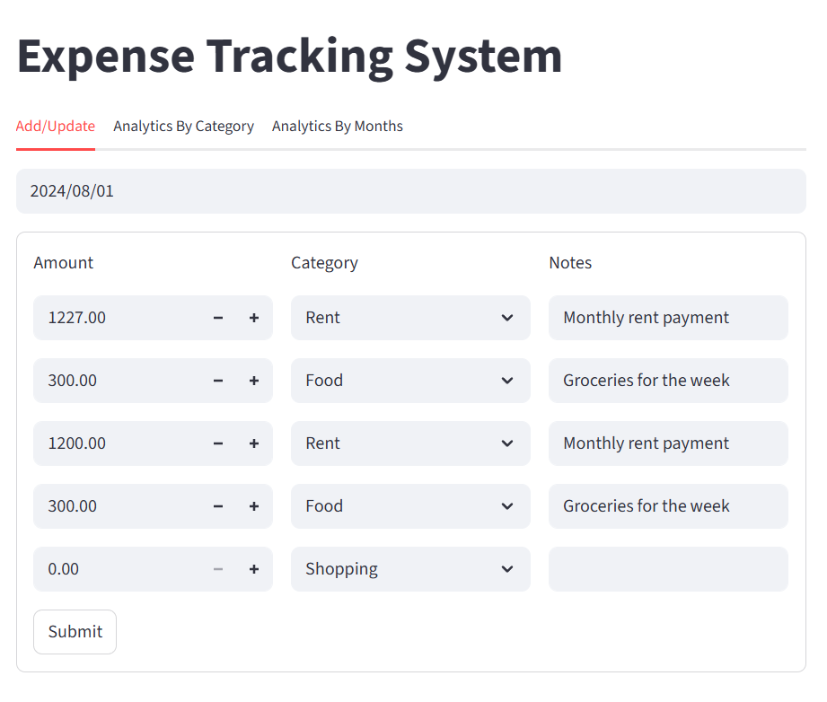
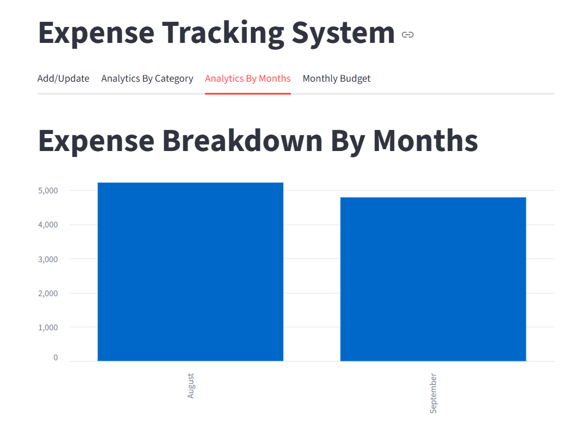
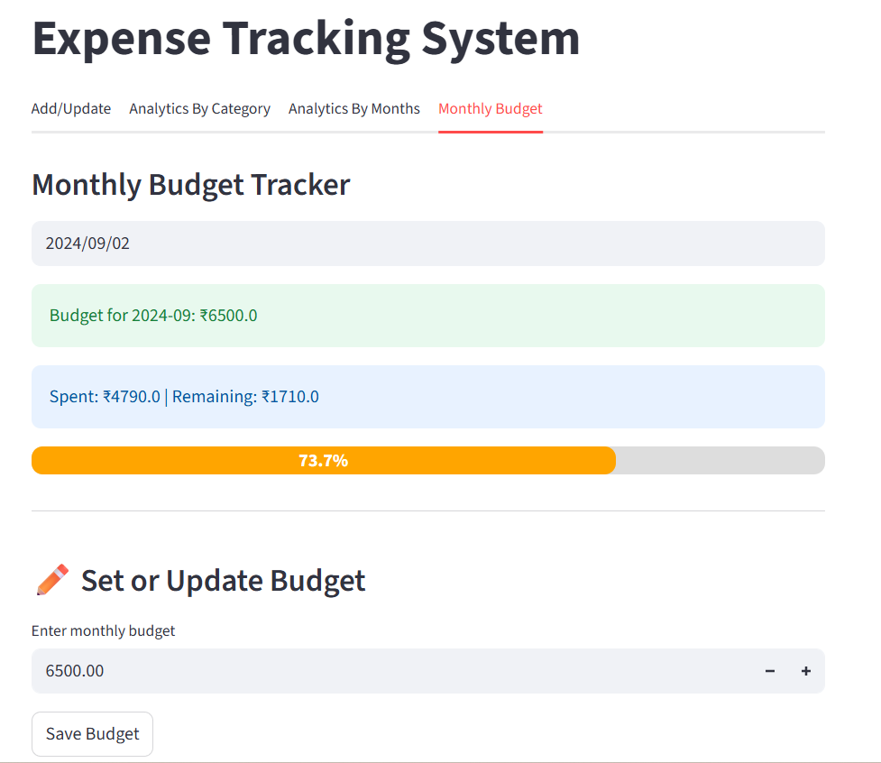

# 💰 Expense Tracking System

An intuitive and efficient **Expense Tracking System** built with **Streamlit** (Frontend) and **FastAPI** (Backend).  
It helps you **track daily expenses, analyze spending trends, and manage your monthly budget** — all in one place!

---

## 🌟 Key Features

### 📅 1. Expense Tracking
- Add, update, and delete expenses by date.
- View your daily expenses in a clean, editable table.
- Categorize expenses (Food, Travel, Utilities, etc.) with notes.

### 📊 2. Category-Wise Analytics
- Visualize where your money goes with **interactive charts**.
- Get quick insights into top spending categories and totals.
###  📊 3. Analytics by month
-Automatic Aggregation — The system automatically groups expenses by month based on transaction date.

-Interactive Visualization — Bars are dynamically updated when new expenses are added or existing ones are updated.

-Insights — Quickly identify spending spikes, trends, or improvement opportunities.
### 💸 4. Monthly Budget Tracker *(New Feature!)*
- Set and update your **monthly budget**.
- Instantly see how much you’ve **spent vs. remaining**.
- Smart progress bar with **color indicators**:
  - 🟢 Green → Within budget  
  - 🟡 Yellow → Near limit  
  - 🔴 Red → Out of budget
- Automatically updates after each budget change — no manual refresh needed!

---

## 📁 Project Structure

```
expense-management-system/
│
├── frontend/                     # Streamlit frontend application
│   └── app.py                    # Main Streamlit app
│
├── backend/                      # FastAPI backend server
│   ├── server.py                 # Core FastAPI app
│   └── db_helper.py              # Database operations
│
├── tests/                        # Unit and integration tests
│
├── requirements.txt              # Required Python dependencies
└── README.md                     # Project overview and setup guide
```


## ⚙️ Setup Instructions

### 1. Clone the Repository
```bash
git clone https://github.com/yourusername/expense-tracking-system.git
cd expense-tracking-system
```

### 2. Install Dependencies
```bash
pip install -r requirements.txt
```

### 3. Run the FastAPI Backend
```bash
uvicorn backend.server:app --reload
```

### 4. Launch the Streamlit Frontend
```bash
streamlit run frontend/app.py
```

🧠 Tech Stack
| Component          | Technology                       |
| ------------------ | -------------------------------- |
| Frontend           | Streamlit                        |
| Backend            | FastAPI                          |
| Database           | MySQL     |
| API Communication  | HTTP (via `requests` library)    |
| Data Visualization | Streamlit Charts & Progress Bars |

## 📸 Application Screenshots

### 💰 Expense Entry & Update
<p align="center">
  
</p>

### 📅 Monthly Analysis
<p align="center">
  
</p>

### 🎯 Budget Tracker
<p align="center">
  
</p>

🚀 Future Enhancements

📈 Add weekly/monthly trend analysis charts

🔔 Smart alerts when budget crosses a threshold

📤 Export reports as PDF/Excel

☁️ Add login and cloud sync (multi-user support)
